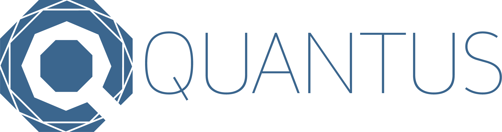

class: center, middle

.linea-superior[]
.linea-inferior[]

<br>



<br>

# Investigación orientada a la acción


<a> Octubre 2022 - Santiago, Chile</a>
<br>
<br>


<a href="http://www.quantus-data.com/" style="float:left">www.quantus-data.com</a>


```{r setup, include=FALSE}
options(htmltools.dir.version = TRUE)
knitr::opts_chunk$set(message = FALSE) 
```

```{r xaringan-themer, include=FALSE, warning=FALSE}
library(xaringanthemer)

style_duo_accent(
  primary_color = "#3D6B96",
  secondary_color = "#007bff",
  inverse_header_color = "#FFFFFF",
   text_font_base = "Rajdhani"
)

```

---

background-image: url("imagenes/fondo2.PNG")
background-size: 80%;
background-position: 100% 100%

### ¿Que nos mueve?

+ El interés por aprender.

+ Trabajo multidisciplinario.


---


