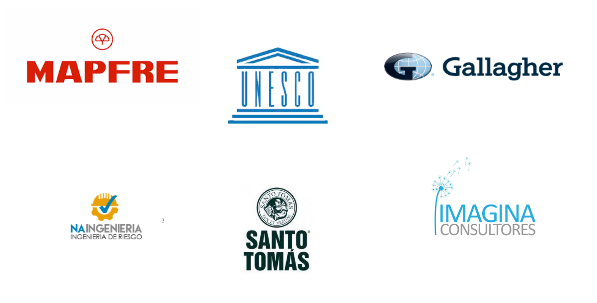
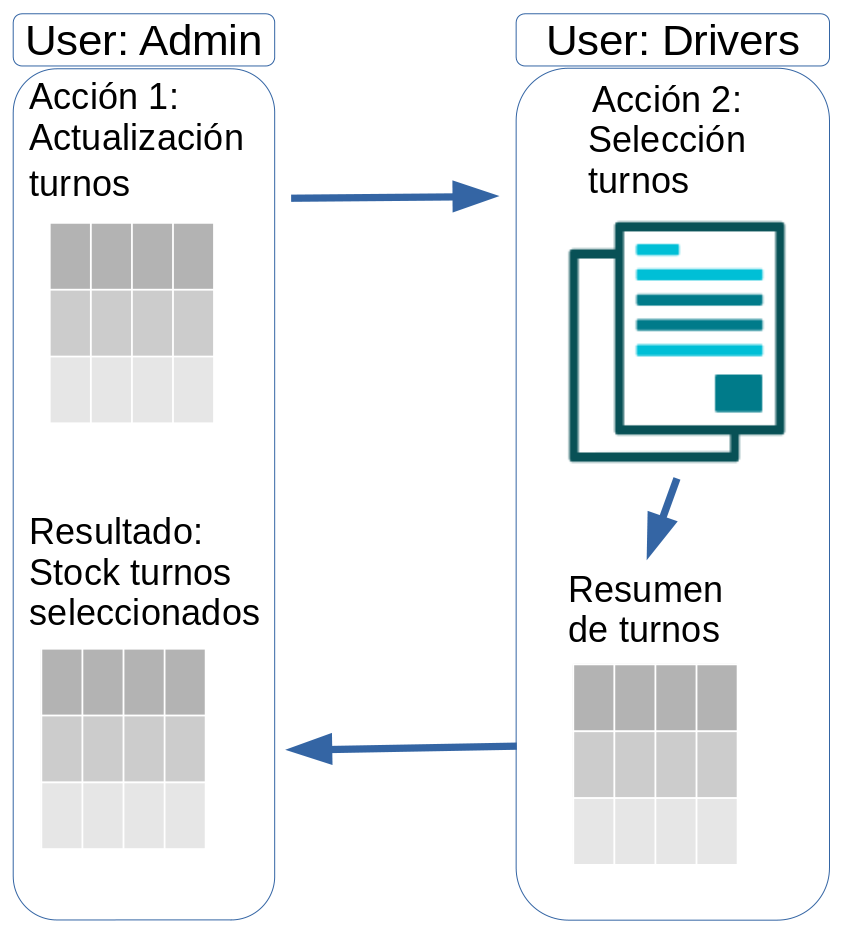

class: center, middle

.linea-superior[]
.linea-inferior[]

<br>


<br>

# Investigación orientada a la acción


<a> Octubre 2022 - Santiago, Chile</a>
<br>
<br>


<a href="http://www.quantus-data.com/" style="float:left">www.quantus.cl</a>


```{r setup, include=FALSE}
options(htmltools.dir.version = TRUE)
knitr::opts_chunk$set(message = FALSE) 
```

```{r xaringan-themer, include=FALSE, warning=FALSE}
library(xaringanthemer)

style_duo_accent(
  primary_color = "#3D6B96",
  secondary_color = "#007bff",
  inverse_header_color = "#FFFFFF",
   text_font_base = "Rajdhani"
)

```

---

background-image: url("imagenes/logo.png")
background-size:  140px 120px
background-position: top right

### ¿Quiénes somos?

+ Equipo multidisciplinario.

+ Interés por entender negocio del cliente.

+ Innovación constante en nuevas tecnologías.

### ¿Qué ofrecemos?

+ Servicios (consultoría) de soluciones tecnológicas desde la ciencia de datos y automatización.

+ Desarrollar soluciones específicas a medida, rapidamente y con posibilidad de incrementar.

+ Se cobra un valor bajo por desarrollo inicial y luego se realiza un cobro por mantenimiento.

---

background-image: url("imagenes/logo.png")
background-size:  140px 120px
background-position: top right

### Nuestro clientes 

.center[]
---


background-image: url("imagenes/logo.png")
background-size:  140px 120px
background-position: top right

### Propuesta 

.pull-left[
.center[]
]

.pull-right[

### Posibles pasos a seguir

- Disponibilizar base de datos
- Generar un servicio con API
- Django

]


---


class: center, middle

# Gracias

<br>
<br>

.center[]

<br>
<br>

<a href="http://www.quantus-data.com/" style="float:center">www.quantus.cl</a>

---


